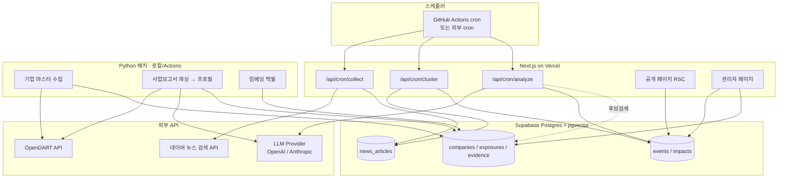

# Event Alpha Korea — 아키텍처 (ARCHITECTURE)

> 문서 버전 0.1 · 2026-07-31 · Phase 0 산출물

---

## 1. 전체 구조



## 2. 파이프라인 6단계

| 단계 | 실행 주체 | 입력 | 출력 | LLM |
|---|---|---|---|---|
| S1 수집 | TS `/api/cron/collect` | watch_keywords | news_articles | ✗ |
| S2 정규화·중복제거 | TS (순수 함수) | 원시 기사 | title_hash, cleaned_title | ✗ |
| S3 클러스터링 | TS `/api/cron/cluster` | 미처리 기사 | events(candidate) + event_articles | ✗ (임베딩만) |
| S4 사전필터 | TS `/api/cron/analyze` | 클러스터 | 관련성 판정 | 소형 모델 |
| S5 이벤트 구조화 | TS `/api/cron/analyze` | 클러스터 제목/요약 | events + steps + requirements | ✓ |
| S6 종목 매칭 | TS (검색=코드, 판정=LLM) | 이벤트 키워드 | event_impacts | ✓(제한) |

**핵심 설계**: S6은 두 부분으로 쪼개진다.
- **후보 생성(검색)** = 100% 결정론적 SQL/pgvector. LLM 관여 없음
- **방향 판정** = LLM. 단, 입력으로 준 후보 목록 밖의 `company_id`는 코드가 버린다

이것이 "AI가 종목을 만들어내지 못하게" 하는 구조적 장치다. 프롬프트 지시가 아니라 타입·집합 검증으로 강제한다.

## 3. 런타임 분리 — 왜 TS와 Python을 나누는가

| | TypeScript (Next.js Route Handler) | Python (로컬 / GitHub Actions) |
|---|---|---|
| 담당 | 뉴스 수집, 클러스터링, 이벤트 분석, 종목 매칭 | OpenDART 대량 수집, 사업보고서 파싱, 기업 프로필 생성, 임베딩 백필 |
| 주기 | 5~15분, 상시 | 수동 / 주 1회 |
| 이유 | Zod 스키마·DB 타입·UI를 한 언어로 공유. Vercel cron에 그대로 물림 | 수천 건 반복·zip/XML 파싱·재시도. 서버리스 타임아웃과 맞지 않음 |
| 상태 | 무상태, 멱등, 배치 크기 제한 | 장시간 실행, 체크포인트 파일 |

원칙: **Vercel 함수 안에서 60초 넘게 걸릴 일은 하지 않는다.** 대량 작업은 전부 Python으로 뺀다.

## 4. 스케줄링 현실 (중요)

| 옵션 | 최소 간격 | 비용 | 판단 |
|---|---|---|---|
| Vercel Cron (Hobby) | **하루 1회** | 무료 | 5분 목표에 부적합 |
| Vercel Cron (Pro) | 분 단위 | $20/월 | 운영 전환 시 |
| GitHub Actions cron | 5분(명목), 실제 5~20분 지연 | 무료 | **MVP 기본값** |
| 외부 cron (cron-job.org 등) | 1분 | 무료 | 정확도 필요 시 |

→ MVP는 GitHub Actions에서 `CRON_SECRET` 헤더로 Route Handler 호출.
"수집 후 5분 이내 분석 완료"는 **파이프라인 처리 시간 목표**이지 수집 지연을 포함한 SLA가 아님을 문서와 UI에 명시한다.

### 4.1 배치 크기 제한

각 tick은 반드시 유한 작업만 한다.

```
collect  : priority 순으로 키워드 최대 8개 (라운드로빈 커서 = watch_keywords.last_run_at)
cluster  : 미처리 기사 최대 100건
analyze  : status='candidate' 이벤트 최대 3건
```

큐가 밀리면 다음 tick이 이어받는다. 이것이 타임아웃 회피 + 재시도의 기본 전략.

### 4.2 중복 실행 방지

`pipeline_runs` 테이블 + Postgres advisory lock 조합.

```sql
select pg_try_advisory_lock(hashtext('cron:analyze'));
-- 실패 시 즉시 200 {skipped: "locked"} 반환
```

추가로 `pipeline_runs(job_name, run_key)` UNIQUE 제약으로 같은 분(minute) 재호출을 차단한다.

## 5. 디렉토리 구조

```
event-alpha-korea/
├─ app/
│  ├─ (public)/            # /, /events, /companies, /about
│  ├─ admin/               # 관리자 전용 (middleware 보호)
│  └─ api/
│     ├─ cron/{collect,cluster,analyze}/route.ts
│     └─ admin/…           # 승인/반려/재분석
├─ lib/
│  ├─ db/                  # supabase client(server/browser/service), types.ts
│  ├─ news/                # naver-client, normalize, dedupe, cluster
│  ├─ llm/                 # provider.ts(interface), openai.ts, anthropic.ts, schemas.ts
│  ├─ matching/            # candidates.ts, scoring.ts, synonyms.ts
│  ├─ events/              # state machine, guards
│  └─ shared/              # zod, logger, errors, banned-words
├─ components/             # shadcn/ui + 도메인 컴포넌트
├─ python/
│  ├─ dart/                # corp_code, report fetch, section extract
│  ├─ profile/             # LLM 구조화 → exposures
│  ├─ embed/               # 임베딩 백필
│  └─ requirements.txt
├─ supabase/migrations/    # 0001_init.sql …
├─ tests/                  # vitest
├─ docs/
└─ .github/workflows/cron.yml
```

## 6. LLM Provider 추상화

```ts
// lib/llm/provider.ts
export interface LlmProvider {
  readonly name: 'openai' | 'anthropic';
  /** JSON Schema 강제 출력. 스키마 위반 시 throw */
  structured<T>(args: {
    schema: z.ZodType<T>;
    schemaName: string;
    system: string;
    user: string;
    model: ModelTier;        // 'cheap' | 'standard'
    maxOutputTokens?: number;
  }): Promise<LlmResult<T>>;
  embed(texts: string[]): Promise<number[][]>;
}

export interface LlmResult<T> {
  data: T;
  usage: { inputTokens: number; outputTokens: number };
  estimatedCostUsd: number;
  model: string;
}
```

- `ModelTier`로 추상화해 provider별 실제 모델명은 설정 파일에 둔다
  (예: cheap → `claude-haiku-4-5-20251001` / `gpt-5-mini`, standard → `claude-sonnet-5`)
- OpenAI는 `response_format: json_schema`, Anthropic은 tool-use 강제 방식으로 각각 구현
- **모든 호출은 `llm_calls` 테이블에 토큰·비용·프롬프트해시를 기록**한 뒤 반환
- 호출 전 `checkDailyBudget()` — 초과 시 `BudgetExceededError`로 파이프라인 정지

## 7. 종목 매칭 엔진 상세

### 7.1 후보 생성 (결정론적, 최대 100개)

이벤트에서 추출된 키워드 배열(`affected_industries/products/raw_materials/customer_groups/geography`)로
`company_exposures`를 다중 경로 검색하고 union한다.

| 경로 | 방식 | 가중 |
|---|---|---|
| 정확 일치 | `exposure_value = keyword` (정규화 후) | 최상 |
| 동의어 | `synonyms` 테이블 확장 후 일치 | 상 |
| 전문검색 | `to_tsvector('simple', exposure_value) @@ plainto_tsquery(...)` | 중 |
| 임베딩 | `exposure_embedding <=> query_embedding < 0.35` | 중 |
| 관계 확장 | 1차 매칭 기업의 `competitor`/`substitute`/`customer` 노출로 1홉 확장 | 하 |

한국어 형태소 분석기는 Supabase에 기본 제공되지 않는다 → `simple` config + **자체 동의어 사전 + 임베딩**으로 보완한다. (RISK §4.3)

### 7.2 점수 계산 (순수 함수, 100점)

`lib/matching/scoring.ts` — 부수효과 없음, 단위 테스트 대상.

| 항목 | 만점 | 규칙 |
|---|---|---|
| 직접 제품 관련성 | 25 | 정확일치 25 / 동의어 20 / 임베딩≥0.85 15 / ≥0.75 8 / 그외 0 |
| 실제 매출·수주 근거 | 20 | revenue_share≥30% 20 / 10~30% 14 / >0 8 / 근거有·수치無 5 / 無 0 |
| 지역 노출 | 15 | 매출지역 일치 15 / 생산지역만 10 / 상위지역(국가↔권역) 8 / 0 |
| 고객·공급망 | 15 | 고객사 직접 15 / 고객산업 10 / 공급사 10 / 경쟁·대체 8 |
| 공식 공시 근거 | 15 | DART+verified 15 / DART 미검수 10 / 뉴스근거 5 / 0 |
| 최근성 | 5 | 보고서 6개월내 5 / 12개월 3 / 24개월 1 / 0 |
| 단순 테마 | 5 | **위 6개 합이 0일 때만** 5점 부여 (테마가 실근거 점수를 밀어올리지 못하게) |

**하드 룰 (점수와 독립적으로 적용)**

```
R1  stock_code == null            → 결과에서 제외
R2  공시근거 0 AND 매출근거 0     → relation_type = 'thematic', score = min(score, 39)
R3  evidence 링크 0건             → relation_type = 'thematic'
R4  score < 20                    → 공개 화면 미노출 (관리자 화면에만)
R5  impact_direction 미결정       → 'uncertain'
```

### 7.3 방향 판정 (LLM, 제한된 입력)

LLM에 넘기는 것은 **후보 기업의 id·이름·매칭된 exposure 행·evidence 발췌뿐**.
전체 기업 DB나 자유 텍스트를 주지 않는다. 출력 후 검증:

```ts
const allowed = new Set(candidates.map(c => c.id));
const clean = llmOut.filter(x => allowed.has(x.company_id));   // I1 강제
const withEvidence = clean.map(x => ({...x,
  evidence_ids: x.evidence_ids.filter(id => allowedEvidence.has(id))  // I4 강제
}));
```

## 8. 이벤트 상태 머신

```
candidate ──analyze──▶ analyzing ──▶ analyzed ──▶ pending_review
                           │                          │
                           ▼                     approve│reject
                        failed                          ▼
                     (retry ≤3)              published / rejected
                                                   │
                                              unpublish
                                                   ▼
                                            pending_review
```

- `published`만 anon RLS 통과 (I8)
- `failed`는 `retry_count<3`이면 다음 tick에 재시도, 초과 시 관리자 큐로
- 상태 전이는 `lib/events/state.ts`의 `canTransition(from,to)` 순수 함수로만

## 9. 오류 처리·로깅

- 외부 API: 지수 백오프 3회(429/5xx만), 4xx는 즉시 실패 기록
- 구조화 로그: `{ ts, level, job, stage, event_id?, article_id?, ms, ok, err_code }` JSON 한 줄
- 실패는 `pipeline_runs.error` + `processing_status='failed'`로 DB에 남긴다 (Vercel 로그는 휘발)
- Route Handler는 절대 500을 반환하지 않고 `{ok:false, reason}` 200으로 응답 — cron 재시도 폭주 방지

## 10. 비용 통제

| 장치 | 내용 |
|---|---|
| 사전 중복 제거 | LLM 호출 전 title_hash·임베딩으로 제거. 가장 큰 절감 |
| 2단계 필터 | S4 사전필터는 cheap 모델 + 제목만 → 무관 기사 조기 탈락 |
| 재분석 금지 | 동일 `event_id` 재분석은 관리자 명시 요청 시에만 |
| 프로필 캐시 | 기업 프로필은 DB에 영속. 사업보고서 갱신 시에만 재생성 |
| 입력 최소화 | 기사 전문 대신 제목+description만 사용 (저작권 원칙과 동일 방향) |
| 일일 상한 | `app_settings.daily_llm_budget_usd`. `llm_calls` 합계 초과 시 정지 |
| 개발 제한 | `NODE_ENV!=='production'`이면 tick당 이벤트 1건 |

## 11. 인증·권한

- Supabase Auth (이메일 매직링크). 관리자 판정은 `profiles.role='admin'`
- 최초 관리자는 seed에서 `ADMIN_EMAIL`로 지정
- `/admin/**`는 middleware에서 세션+role 확인, 서버 액션에서 **재검증** (미들웨어만 믿지 않음)
- `SUPABASE_SERVICE_ROLE_KEY`는 Route Handler·Python에서만. 클라이언트 번들 유입 방지 테스트 추가

## 12. 환경변수

```env
NEXT_PUBLIC_SUPABASE_URL=
NEXT_PUBLIC_SUPABASE_ANON_KEY=
SUPABASE_SERVICE_ROLE_KEY=

NAVER_CLIENT_ID=
NAVER_CLIENT_SECRET=

OPENDART_API_KEY=

LLM_PROVIDER=anthropic
OPENAI_API_KEY=
ANTHROPIC_API_KEY=

CRON_SECRET=
ADMIN_EMAIL=
```

`.env.example`만 커밋. `.env*`는 `.gitignore`. Zod로 부팅 시 검증(`lib/shared/env.ts`).
